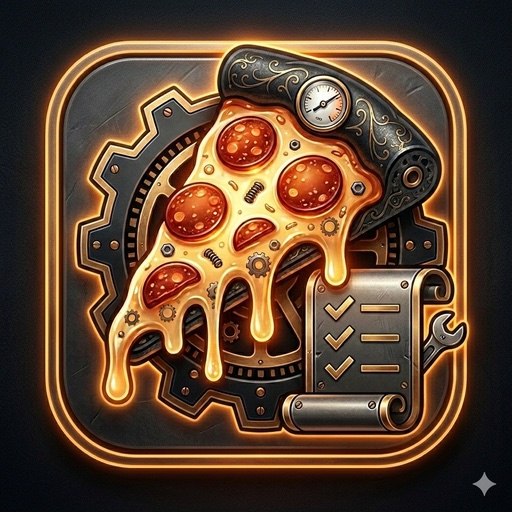

# StockFlow Pro — Guia de Design Premium v10
## Cores, Tipografia, Componentes HTML · Apple HIG iOS 17/18

---

## 1. COMO INTEGRAR

### index.html — adicionar no `<head>`, após os patches existentes:
```html
<!-- Após patch-v980.css e bg-upload.css -->
<link rel="stylesheet" href="./apple-premium-v10.css">
```

### ficha-tecnica.html — adicionar no `<head>`:
```html
<!-- Após ft-style.css -->
<link rel="stylesheet" href="./apple-premium-v10.css">
```

### sw.js — adicionar à lista `ASSETS`:
```js
'./apple-premium-v10.css',
```

---

## 2. SISTEMA DE CORES

O apple-premium-v10.css estende os tokens já definidos no style.css.
Todos os valores abaixo são os tokens semânticos usados pelos componentes.

### Paleta base (Dark Premium — padrão)
| Token                | Valor          | Uso                              |
|----------------------|----------------|----------------------------------|
| `--bg`               | `#0A0A0E`      | Fundo do app                     |
| `--surface`          | `#17171C`      | Cards, linhas de tabela          |
| `--surface-2`        | `#212128`      | Inputs, backgrounds elevados     |
| `--surface-3`        | `#2C2C34`      | Pressed states, selects          |
| `--text`             | `#F5F5F7`      | Texto primário                   |
| `--text-soft`        | `#C7C7CC`      | Texto secundário                 |
| `--text-muted`       | `#8E8E93`      | Placeholders, labels             |
| `--accent-primary`   | `#0A84FF`      | Azul sistema iOS (dark)          |
| `--btn-green`        | `#30D158`      | Sucesso, confirmação             |
| `--btn-red`          | `#FF453A`      | Perigo, exclusão                 |
| `--btn-star`         | `#FF9F0A`      | Alerta, favorito                 |
| `--accent-glow`      | `rgba(10,132,255,0.30)` | Sombra de foco/glow  |

### Novos tokens de elevação (v10)
| Token       | Uso típico                             |
|-------------|----------------------------------------|
| `--elev-0`  | Sem sombra (pressed)                   |
| `--elev-1`  | Card de tabela, item de lista          |
| `--elev-2`  | Card hover, modal interno              |
| `--elev-3`  | Float cluster, lupa, tooltips          |
| `--elev-4`  | Modais, bottom sheets                  |
| `--elev-5`  | Full-screen overlays                   |

### Gradientes semânticos (v10)
```css
--grad-accent:  /* Azul → Roxo — botão primário, FAB */
--grad-danger:  /* Vermelho — swipe delete, botão destrutivo */
--grad-success: /* Verde — confirmação, salvo */
--grad-gold:    /* Laranja/Amarelo — alerta, swipe alert */
```

### Adaptação automática por tema
O apple-premium-v10.css sobrescreve automaticamente `--elev-*`,
`--vibrancy-bg`, `--sep` e `--sheet-handle` para Arctic Silver
(light mode), Midnight OLED e Deep Forest. Nenhum JS necessário.

---

## 3. TIPOGRAFIA

### Fonte principal
```css
font-family: -apple-system, 'SF Pro Text', 'SF Pro Display',
             BlinkMacSystemFont, 'Helvetica Neue', Arial, sans-serif;
```
No iOS, isso resolve para **SF Pro** automaticamente.
No macOS, resolve para **SF Pro** ou **Helvetica Neue**.
No Android/Chrome, resolve para **Roboto** (aceitável para PWA).

### Escala tipográfica Apple HIG
| Nível         | size / weight / tracking | Uso                        |
|---------------|--------------------------|----------------------------|
| Large Title   | 34px / 700 / -0.8px      | Títulos de seção principal  |
| Title 1       | 28px / 700 / -0.5px      | Cabeçalho de modal          |
| Title 2       | 22px / 700 / -0.4px      | Subtítulo de seção          |
| Title 3       | 20px / 600 / -0.3px      | Nome de produto             |
| Headline      | 17px / 600 / -0.2px      | Label primário              |
| Body          | 17px / 400 / 0           | Texto de conteúdo           |
| Callout       | 16px / 400 / 0           | Inputs, dropdowns           |
| Subheadline   | 15px / 400 / 0           | Quantidade, unidade         |
| Footnote      | 13px / 400 / 0           | Categoria header, metadados |
| Caption 1     | 12px / 600 / +0.5px      | Labels uppercase            |
| Caption 2     | 11px / 500 / +0.3px      | Badges, chips               |

### Regras práticas
- **Sempre** use `font-variant-numeric: tabular-nums` em preços e quantidades
- **Nunca** use `font-size < 16px` em inputs (previne zoom no iOS Safari)
- Use `letter-spacing: -0.3px` a `-0.8px` em títulos grandes (SF Pro é generoso)
- `line-height: 1.4` para conteúdo; `1.2` para títulos; `1` para botões

---

## 4. MOTION — CURVAS DE ANIMAÇÃO

### Novos tokens de spring (v10)
```css
--spring-snappy: cubic-bezier(0.34, 1.56, 0.64, 1)
/* Overshoots levemente → sensação de elasticidade. Uso: botões, checkboxes */

--spring-gentle: cubic-bezier(0.22, 1.20, 0.36, 1)
/* Natural, sem overshoot. Uso: entradas de tela, bottom sheets */

--spring-bounce: cubic-bezier(0.175, 0.885, 0.32, 1.275)
/* Pop visível. Uso: badges, ícones de confirmação */

--ease-decel: cubic-bezier(0.0, 0.0, 0.2, 1)
/* Desacelera suavemente. Uso: hovers, cor, opacidade */
```

### Durações
| Token          | ms    | Uso                                |
|----------------|-------|------------------------------------|
| `--dur-instant`| 80ms  | Pressed state, tap feedback        |
| `--dur-fast`   | 160ms | Hover, cor, opacidade              |
| `--dur-normal` | 280ms | Entradas de card, modais           |
| `--dur-slow`   | 420ms | Bottom sheets, transições de tela  |
| `--dur-reveal` | 540ms | Animações de onboarding            |

### Regra de ouro
> **instant** para feedback → **fast** para mudança visual → **normal** para layout → **slow** para navegação

---

## 5. COMPONENTES HTML

### 5.1 Product Card (linha de tabela aprimorada)
O CSS já estiliza automaticamente as `<tr>` existentes como cards.
Para criar um card standalone fora da tabela:

```html
<div class="ap-inset-group">
  <!-- Item disclosure -->
  <div class="ap-disclosure-row">
    <div style="display:flex; align-items:center; gap:12px;">
      <span style="font-size:22px;">🧀</span>
      <div>
        <div style="font-size:15px; font-weight:600; color:var(--text)">Mussarela</div>
        <div style="font-size:13px; color:var(--text-muted)">1,500 kg em estoque</div>
      </div>
    </div>
    <span class="ap-pill ap-pill-success">OK</span>
  </div>

  <div class="ap-disclosure-row">
    <div style="display:flex; align-items:center; gap:12px;">
      <span style="font-size:22px;">🥩</span>
      <div>
        <div style="font-size:15px; font-weight:600; color:var(--text)">Calabresa</div>
        <div style="font-size:13px; color:var(--text-muted)">0,200 kg em estoque</div>
      </div>
    </div>
    <span class="ap-pill ap-pill-danger">Baixo</span>
  </div>
</div>
```

---

### 5.2 Navigation Bar
```html
<!-- Sticky nav com glassmorphism — adicionar em index.html -->
<header id="app-header" style="
  display: flex;
  align-items: center;
  justify-content: space-between;
  padding: 14px 16px;
  padding-top: max(14px, env(safe-area-inset-top));
">
  <div style="display:flex; align-items:center; gap:10px;">
    
    <div>
      <div style="font-size:17px; font-weight:700; letter-spacing:-0.3px; color:var(--text)">
        StockFlow
      </div>
      <div style="font-size:11px; font-weight:600; color:var(--accent-primary); letter-spacing:0.04em; text-transform:uppercase;">
        PRO
      </div>
    </div>
  </div>

  <div style="display:flex; align-items:center; gap:8px;">
    <!-- Badge de status -->
    <span id="status-save" style="opacity:0; transition:opacity 0.3s;">
      ✓ Salvo
    </span>
    <!-- Botão de sync -->
    <button style="
      width:36px; height:36px;
      border-radius:9999px;
      background:var(--surface-2);
      border:1px solid var(--border);
      color:var(--text-muted);
      display:flex; align-items:center; justify-content:center;
      cursor:pointer;
    ">☁</button>
  </div>
</header>
```

---

### 5.3 Segmented Control
```html
<!--
  data-tabs="3" → 3 opções
  --_seg-idx    → índice do item ativo (CSS var, controlado via JS)
-->
<div class="ap-seg-ctrl" data-tabs="3" id="filtro-seg">
  <button class="ap-seg-btn active" data-idx="0">Todos</button>
  <button class="ap-seg-btn"        data-idx="1">Carnes</button>
  <button class="ap-seg-btn"        data-idx="2">Laticínios</button>
</div>

<script>
// Snippet JS para animar o thumb do Segmented Control
document.querySelectorAll('.ap-seg-ctrl').forEach(ctrl => {
  ctrl.querySelectorAll('.ap-seg-btn').forEach(btn => {
    btn.addEventListener('click', () => {
      ctrl.querySelectorAll('.ap-seg-btn').forEach(b => b.classList.remove('active'));
      btn.classList.add('active');
      // Move o thumb CSS via custom property
      ctrl.style.setProperty('--_seg-idx', btn.dataset.idx);
    });
  });
});
</script>
```

---

### 5.4 Bottom Sheet
```html
<!-- Overlay (fundo escurecido) -->
<div class="ap-sheet-overlay" id="sheet-editar">
  <!-- Sheet em si -->
  <div class="ap-sheet">
    <!-- Handle automático via ::before -->

    <div class="ap-sheet-header">
      <span class="ap-sheet-title">Editar Item</span>
      <button class="ap-sheet-close" id="sheet-close-btn">✕</button>
    </div>

    <div class="ap-sheet-body">
      <!-- Conteúdo do formulário -->
      <label style="font-size:12px; font-weight:600; text-transform:uppercase;
                    letter-spacing:0.5px; color:var(--text-muted); display:block; margin-bottom:6px;">
        Nome do produto
      </label>
      <input type="text" placeholder="Ex: Mussarela"
             style="width:100%; padding:14px 16px; border-radius:var(--radius-md);
                    background:var(--surface-2); border:1.5px solid var(--border);
                    color:var(--text); font-size:16px; font-family:inherit;
                    outline:none; transition:border-color var(--dur-fast) var(--ease-decel);">

      <div style="height:16px;"></div>

      <!-- Botão primário -->
      <button style="
        width:100%; padding:16px;
        border-radius:var(--radius-md);
        background:var(--grad-accent);
        border:none; color:#fff;
        font-size:16px; font-weight:700;
        letter-spacing:-0.2px;
        cursor:pointer;
        box-shadow:0 4px 16px var(--accent-glow), var(--elev-2);
        transition:transform var(--dur-instant) var(--spring-snappy),
                   filter var(--dur-fast) var(--ease-decel);
      ">
        Salvar alterações
      </button>
    </div>
  </div>
</div>

<script>
// Abrir/fechar o sheet
function abrirSheet(id) {
  document.getElementById(id).classList.add('open');
  document.body.style.overflow = 'hidden'; // evita scroll de fundo
}
function fecharSheet(id) {
  document.getElementById(id).classList.remove('open');
  document.body.style.overflow = '';
}

// Fechar ao clicar fora
document.getElementById('sheet-editar').addEventListener('click', function(e) {
  if (e.target === this) fecharSheet('sheet-editar');
});
document.getElementById('sheet-close-btn').addEventListener('click', () => {
  fecharSheet('sheet-editar');
});

// Swipe-to-dismiss (básico)
let startY = 0;
const sheet = document.querySelector('#sheet-editar .ap-sheet');
sheet.addEventListener('touchstart', e => {
  startY = e.touches[0].clientY;
  sheet.classList.add('dragging');
}, { passive: true });
sheet.addEventListener('touchmove', e => {
  const dy = e.touches[0].clientY - startY;
  if (dy > 0) sheet.style.transform = `translateY(${dy}px)`;
}, { passive: true });
sheet.addEventListener('touchend', e => {
  sheet.classList.remove('dragging');
  const dy = e.changedTouches[0].clientY - startY;
  if (dy > 120) {
    fecharSheet('sheet-editar');
  }
  sheet.style.transform = '';
});
</script>
```

---

### 5.5 Progress Badge (custo vs limite)
```html
<!-- Uso na Lista Fácil / Ficha Técnica -->
<div style="display:flex; align-items:center; gap:10px; padding:12px 0;">
  <span style="font-size:13px; color:var(--text-soft); flex:1;">Orçamento usado</span>
  <span style="font-size:13px; font-weight:700; color:var(--btn-green);">67%</span>
</div>
<div class="ap-progress">
  <div class="ap-progress-fill success" style="width:67%;"></div>
</div>

<!-- Versão crítica -->
<div class="ap-progress" style="margin-top:8px;">
  <div class="ap-progress-fill danger" style="width:94%;"></div>
</div>
```

---

### 5.6 Badges e Pills de status
```html
<!-- Pill com dot colorido -->
<span class="ap-pill ap-pill-success">OK</span>
<span class="ap-pill ap-pill-danger">Crítico</span>
<span class="ap-pill ap-pill-warning">Atenção</span>
<span class="ap-pill ap-pill-accent">Novo</span>
<span class="ap-pill ap-pill-neutral">Inativo</span>

<!-- Badge numérico (notificação) -->
<div style="position:relative; display:inline-block;">
  <button>Dashboard</button>
  <span class="ap-badge" style="position:absolute; top:-6px; right:-6px;">3</span>
</div>

<!-- Skeleton (loading state) -->
<div class="ap-skeleton" style="height:44px; margin-bottom:8px;"></div>
<div class="ap-skeleton" style="height:44px; margin-bottom:8px;"></div>
<div class="ap-skeleton" style="height:44px;"></div>
```

---

## 6. CHECKLIST DE QUALIDADE APPLE HIG

### Layout & Espaçamento ✅
- [ ] Todos os elementos respeitam `env(safe-area-inset-*)` nas bordas
- [ ] Grid de 8px: paddings em múltiplos de 4px ou 8px
- [ ] `border-radius` mínimo de 14px em cards; 20px+ em modais
- [ ] Separadores com `0.5px` (não `1px`) — mais natural em Retina

### Tipografia ✅
- [ ] Nenhum input com `font-size < 16px` (evita zoom iOS Safari)
- [ ] Títulos com `letter-spacing` negativo (`-0.3px` a `-0.8px`)
- [ ] Preços e quantidades com `font-variant-numeric: tabular-nums`
- [ ] Hierarquia clara: peso 700 → 600 → 400 sem pular níveis

### Interação ✅
- [ ] Todo elemento clicável tem `min-height: 44px` e `min-width: 44px`
- [ ] Press state com feedback visual instantâneo (≤80ms)
- [ ] Transições ≥ 2 propriedades usam a mesma curva de easing
- [ ] `will-change: transform` apenas em elementos que realmente animam

### Performance ✅
- [ ] Backdrop-filter só em elementos fixos/sticky (sem reflow)
- [ ] Animações de entrada usam `transform` e `opacity` (compositor)
- [ ] `animation-fill-mode: both` para evitar flash antes da animação
- [ ] `@media (prefers-reduced-motion)` implementado ✅ (no CSS)

### Acessibilidade ✅
- [ ] Contraste mínimo 4.5:1 para texto (WCAG AA)
- [ ] `aria-label` em botões de ícone
- [ ] Focus ring visível (não apenas `:hover`)
- [ ] Não depende apenas de cor para transmitir informação

---

## 7. GUIA DE APLICAÇÃO POR MÓDULO

### Tabela de Estoque (index.html)
O CSS aplica automaticamente:
- Linhas como cards com `border-radius: 20px`
- Checkboxes animados com spring
- Entrada staggerada de linhas
- Hover lift em desktop
- Linha marcada com gradiente azul à esquerda

### Ficha Técnica (ficha-tecnica.html)
O CSS aplica automaticamente:
- Cards de ingrediente/receita com elevação e hover
- KPI cards com reflexo de luz no topo (efeito Apple Card)
- Modais como bottom sheets com glassmorphism
- Custo total com texto gradiente quando preenchido

### Componentes manuais
Use as classes `.ap-*` para novos elementos:
- `.ap-seg-ctrl` → filtros de categoria, seletor de tamanho
- `.ap-sheet-overlay` + `.ap-sheet` → qualquer formulário mobile
- `.ap-pill-*` → status de estoque, alertas
- `.ap-progress` → gauge de orçamento, progresso de custo
- `.ap-skeleton` → loading states assíncronos

---

*StockFlow Pro — apple-premium-v10 · Guia de Design · Março 2026*
